<!--
SPDX-License-Identifier: AGPL-3.0-or-later
Copyright (C) 2022-2023 Dyne.org foundation <foundation@dyne.org>.

This program is free software: you can redistribute it and/or modify
it under the terms of the GNU Affero General Public License as
published by the Free Software Foundation, either version 3 of the
License, or (at your option) any later version.

This program is distributed in the hope that it will be useful,
but WITHOUT ANY WARRANTY; without even the implied warranty of
MERCHANTABILITY or FITNESS FOR A PARTICULAR PURPOSE.  See the
GNU Affero General Public License for more details.

You should have received a copy of the GNU Affero General Public License
along with this program.  If not, see <https://www.gnu.org/licenses/>.
-->

# Zencode crypto client side, for web and mobile applications

The repo contains multiple cryptographic flows, to be executed in web and mobile applications (client side): 
- Keypairoom: keyring generation flow
- Coconut: zero knowledge proof, attribute based credential, with user authentication, based on the [Coconut paper](https://arxiv.org/pdf/1802.07344)
- Reflow Multisignature: anonymous homomorphic multisignature flow on BLS12381, solving rogue-attacks issue [Reflow paper](https://arxiv.org/abs/2105.14527)

------

# Repository organization

Zencode is executed by the [Zenroom](http://zenroom.org) VM running inside the client as a binary or a [WASM assembly packages in NPM](https://www.npmjs.com/package/zenroom).

The language documentation is found on [dev.zenroom.org](https://dev.zenroom.org).

The `keypairoom` directory contains the scripts used to create a keyring.

The `coconut` directory contains the scripts used to manage the zero knowledge proof flow, client side.

The `reflow` directory contains the scripts used used to manage the reflow Multisignature flow, client side.

The `test` directory contains unit tests (single scripts tested in local) and integration tests (shell scripts that call staging instances to test its api).

# Sequence diagrams

Below are detailed the crypto exchanges taking place in the repo.

## Login creation

```mermaid
sequenceDiagram
autonumber
  participant U as 🤓User
  participant C as 📱Client
  participant S as Server

  S->>S: Configured with secret salt 
  C->>U: Greets, asks email, name and challenges 
  U->>C: Answers email, name
  C->>+S: Sends name and email to server (ASAP)
  S->>S: Verifies email is not a duplicate
  S->>S: Compute HMAC of email with secret salt
  S->>-C: Sends HMAC (ASAP)
  U->>C: User provides answers to challenges
  C->>C: Generate SEED with PBKDF of HASH(answers) with HMAC
  C->>S: (Optional) Generate KDF dictionary of individual answers
  C->>C: Generate public keys from SEED
  C->>S: Sends public keys
```

### Zencode

- [keypairoomClient-8-9-10-11-12](src/keypairoomClient-8-9-10-11-12.ts)
- [keypairoomServer-6-7](src/keypairoomServer-6-7.zen)
- [keypairoomClientRecreateKeys](src/keypairoomClientRecreateKeys.ts)

### Notes

- 1: Secret salt is generated at server install and saved as an HEX string in its configuration
- 2: Interactive GUI poses all questions in one page: email, name and 5 challenges
- 4: As soon as User answers name and email, reactive page sends them to server (ASAP)
- 7: As soon as Client receives HMAC the Submit button is green
- 8: May happen in parallel while Client and Server are handshaking the HMAC (ASAP)
- 9: May need User confirmation that the answers given to challenges are OK
- 10: Useful to facilitate seed recovery: the server can check validity of single answers
- 12: Start with EDDSA public keys, seed is reused for more key types when needed

-----------------

## 💼 License

    Zenflows crypto

    Copyright (c) 2021-2022 Dyne.org foundation, Amsterdam

    This program is free software: you can redistribute it and/or modify
    it under the terms of the GNU Affero General Public License as
    published by the Free Software Foundation, either version 3 of the
    License, or (at your option) any later version.

    This program is distributed in the hope that it will be useful,
    but WITHOUT ANY WARRANTY; without even the implied warranty of
    MERCHANTABILITY or FITNESS FOR A PARTICULAR PURPOSE.  See the
    GNU Affero General Public License for more details.

    You should have received a copy of the GNU Affero General Public License
    along with this program.  If not, see <http://www.gnu.org/licenses/>.

